# Emoji Picker React

**Batteries included. Or BYOD — bring your own design.**

One emoji-picker engine, with two ways to build your UI: use the complete picker, or bring your own design, design language and design library.

> **Batteries included:** `npm install emoji-picker-react`, render `<EmojiPicker />`, done — a complete, accessible, themed picker with search, categories, skin tones, recents and keyboard navigation. No CSS import, no configuration, no design work.
>
> **BYOD (bring your own design):** pass `unstyled`, or compose your own layout from `emoji-picker-react/primitives`, and style it with whatever your app already uses — Tailwind, shadcn/ui, CSS Modules, Emotion, styled-components, MUI or plain CSS. Accessibility, keyboard navigation and virtualization stay built in.

[](https://www.npmjs.com/package/emoji-picker-react)

**[Live demo](https://ealush.com/emoji-picker-react)** · **[Props](PROPS.md)** · **[BYOD](#byod-bring-your-own-design)** · **[Common tasks](#common-tasks)** · **[For AI assistants](#for-ai-assistants)** · **[Report a bug](https://github.com/ealush/emoji-picker-react/issues)** · **[Sponsor](https://github.com/sponsors/ealush)**


## Features

- **Batteries included** — one component, sensible defaults, light/dark/auto themes, no stylesheet to import.
- **BYOD** — `unstyled` drops the chrome and composable primitives let you build any layout, styled with plain CSS, CSS Modules, Tailwind, shadcn/ui, Emotion, styled-components or MUI. See [25 designs](#design-examples) built this way.
- **Accessible** — full keyboard navigation, ARIA grid semantics, localizable labels, right-to-left layouts, reduced-motion support and automated axe checks. [Screen-reader release checks](docs/v5/ACCESSIBILITY_VERIFICATION.md) document manual verification.
- **Reactions mode** — a compact reactions bar that expands to the full picker.
- **Localized** — 28 emoji datasets; translate search, categories, previews, reactions, skin tones, loading errors and retry controls, including accessible announcements.
- **Emoji styles** — native (default), Apple, Google, Facebook, Twitter; native mode filters detected unsupported OS glyphs, including individual sequences and skin tones. See [detection limits](docs/v5/API.md#5c-native-emoji-support-detection).
- **Custom emojis** — image-based emojis, optionally in their own named groups.
- **Lean when you want** — the primitives entry loads the dataset on demand (a 34 KiB min+gz startup budget including ShipStyles; see the consumer gate); a framework-free data API for search and lookup.
- **Modern React** — React 16.8 through 19, SSR, React Server Components (`"use client"` entries), TypeScript types included; ships ES2020 for every browser since 2020 and any modern bundler.

> **Upgrading from v4?** Most code works unchanged; the default emoji style is now native, and markup, styling and package boundaries have changed. See [Migrating from v4](docs/v5/MIGRATION.md). The APIs on this page need `emoji-picker-react@5` or later.

## Copyable integration prompts

Use the [setup, customization, recipe adoption and v5 migration prompts](docs/v5/PROMPTS.md)
to give a coding agent a concrete starting point for your application. Each
prompt checks the installed version and keeps integration behavior explicit.

## Quick start (batteries included)

```bash
npm install emoji-picker-react
```

Requires **React 16.8 or later** and **Node 18 or later** in your build toolchain. (Contributors to this repository use Node 24; see [CONTRIBUTING.md](CONTRIBUTING.md).)

```jsx
import EmojiPicker from 'emoji-picker-react';

function App() {
  return (
    <EmojiPicker onEmojiClick={(emojiData) => console.log(emojiData.emoji)} />
  );
}
```

That is the whole setup. `onEmojiClick` receives an `EmojiClickData` object (`emoji`, `unified`, `names`, `imageUrl`, `activeSkinTone`, …) and the event.

```jsx
<EmojiPicker colorScheme="dark" width={320} height={400} previewConfig={{ showPreview: false }} />
```

See [PROPS.md](PROPS.md) for every prop.

## Choose your path

| You want | Use | You style |
| --- | --- | --- |
| A complete picker now | `<EmojiPicker />` | Nothing |
| The built-in look in your brand's colors and sizes | `<EmojiPicker />` + `colorScheme` and `--epr-*` variables | A few variables |
| Your own design on the supplied layout | `<EmojiPicker unstyled />` | Every part, with your CSS or styling library |
| Your own layout and components | `emoji-picker-react/primitives` | Layout and parts, or reuse the built-in look with `appearance="default"` |

Every path keeps the same behavior: keyboard navigation, focus management, ARIA semantics, virtualization, skin tones, variations, recents, search and localization.

**One rule decides how styling works:** color variables (`--epr-bg-color`, `--epr-highlight-color`, …) theme the *built-in look*. `unstyled` and a bare primitives `Root` remove the built-in look, so color variables have no effect there. You style the parts directly. Size variables (`--epr-emoji-size`, paddings, heights) apply in every mode.

## BYOD: bring your own design

Bring your own design, design language and design library. Keep the supplied layout with `unstyled`, or compose the parts and use your own input, emoji buttons, category headers, preview and tone controls. Search, localization, keyboard navigation and virtualization share the same engine in both paths.

The picker needs no stylesheet import. Its CSS is injected automatically, once per document or shadow root, and scoped so it never leaks into your app.

How overrides work, so you never fight specificity:

- **Design variables (`--epr-*`) always yield to your CSS.** Their defaults are emitted at zero specificity, so a single class wins in any load order.
- **Parts are targetable** with stable `[data-epr-part="…"]` selectors: `root`, `panel`, `search`, `search-input`, `search-clear`, `skin-tone`, `skin-tone-button`, `category-nav`, `category-tab`, `viewport`, `list`, `category`, `category-label`, `category-content`, `emoji`, `variation-picker`, `preview`, `empty`, `loading`, `load-error`, `reactions`, `reaction`, `expand-reactions`. State is exposed as `[data-epr-active]` (hovered or focused emoji, active tab or tone), `[aria-selected="true"]` (current tab) and `[aria-pressed="true"]` (current tone). The full contract: [docs/v5/STYLING.md](docs/v5/STYLING.md).
- **CSS ownership is explicit.** Library classes protect layout from ordinary element/universal resets. More specific rules and `!important` can still override geometry; preserve the [structural contract](docs/v5/STYLING.md).
- **Layered frameworks:** with Tailwind v4 (or any `@layer`-based setup), pass `cssLayer="epr"` and declare the layer first — `@layer epr, theme, base, components, utilities;` — so utilities override the picker.

### Theme the built-in look with CSS variables

```css
.my-picker {
  --epr-bg-color: #0f172a;
  --epr-category-label-bg-color: #0f172ae6;
  --epr-search-input-bg-color: #1e293b;
  --epr-search-input-bg-color-active: #1e293b;
  --epr-picker-border-color: #1e293b;
  --epr-text-color: #cbd5e1;
  --epr-highlight-color: #22d3ee;
  --epr-hover-bg-color: #1e293b;
  --epr-focus-bg-color: #334155;
  --epr-emoji-size: 28px;
}

.my-picker [data-epr-part='category-label'] {
  text-transform: uppercase;
  letter-spacing: 0.08em;
}
```

```jsx
<EmojiPicker colorScheme="dark" className="my-picker" />
```

Sticky category labels and the search field have their own surfaces, so set their variables along with `--epr-bg-color`. All variables: [CSS_VARIABLES.md](CSS_VARIABLES.md).

### Unstyled: your design, the supplied layout

`unstyled` removes decorative styling from every part: colors, borders, rounding, button resets, typography and the search icon. Layout, geometry, virtualization, keyboard behavior and visibility stay managed. You start from plain browser controls and style the parts with your own CSS. This is a complete starting point:

```css
.my-picker {
  background: Canvas;
  color: CanvasText;
  border: 1px solid #8884;
  border-radius: 12px;
  font: 14px system-ui, sans-serif;
}
.my-picker [data-epr-part='search-input'] {
  padding-inline-start: 10px;
  border: 1px solid #8886;
  border-radius: 8px;
  background: transparent;
  color: inherit;
  font: inherit;
}
.my-picker :is([data-epr-part='emoji'], [data-epr-part='category-tab'],
    [data-epr-part='search-clear'], [data-epr-part='skin-tone-button']) {
  border: 0;
  border-radius: 8px;
  background: transparent;
  color: inherit;
  cursor: pointer;
}
.my-picker [data-epr-part='emoji'][data-epr-active],
.my-picker [data-epr-part='category-tab'][aria-selected='true'] {
  background: #8882;
}
.my-picker :is(button, input):focus-visible {
  outline: 2px solid Highlight;
  outline-offset: -2px;
}
.my-picker [data-epr-part='category-label'] {
  font-size: 12px;
  font-weight: 600;
  background: Canvas;
}
.my-picker [data-epr-part='variation-picker'] {
  background: Canvas;
  border: 1px solid #8884;
  border-radius: 10px;
  box-shadow: 0 4px 12px #0003;
}
```

```jsx
<EmojiPicker unstyled className="my-picker" />
```

It follows the page's light or dark `color-scheme`. Keep a visible focus style on buttons and the input. Overlays such as the skin-tone variation popover (`variation-picker`) are transparent until you give them a surface. The same selectors work from CSS Modules (`:global([data-epr-part='emoji'])` inside your module class), Emotion, styled-components, Tailwind arbitrary variants (`[&_[data-epr-part=emoji]]:rounded-lg`) and MUI's `styled`.

### Tailwind CSS (v4)

```css
/* app.css */
@layer epr, theme, base, components, utilities;
@import 'tailwindcss';
```

```jsx
<EmojiPicker
  cssLayer="epr"
  className="rounded-2xl shadow-xl [--epr-bg-color:var(--color-white)] [--epr-highlight-color:var(--color-indigo-600)] [--epr-hover-bg-color:var(--color-indigo-50)] [&_[data-epr-part=emoji]]:rounded-lg"
/>
```

Utilities apply to the root; arbitrary properties set variables and arbitrary variants reach the parts. For a fully custom design, add `unstyled` and style the parts with utilities instead of variables.

### shadcn/ui

Map the picker's variables to shadcn's theme variables once; light, dark and custom themes then follow automatically:

```css
.emoji-picker {
  --epr-bg-color: var(--popover);
  --epr-category-label-bg-color: var(--popover);
  --epr-text-color: var(--muted-foreground);
  --epr-highlight-color: var(--primary);
  --epr-hover-bg-color: var(--accent);
  --epr-focus-bg-color: var(--accent);
  --epr-picker-border-color: var(--border);
  --epr-search-input-bg-color: transparent;
  --epr-search-border-color: var(--input);
  --epr-search-border-color-active: var(--ring);
}
```

```jsx
<PopoverContent className="w-auto p-0">
  <EmojiPicker cssLayer="epr" className="emoji-picker" onEmojiClick={(e) => insert(e.emoji)} />
</PopoverContent>
```

For a component that uses your shadcn input and buttons directly, install the [registry component](#ready-to-adapt-starters).

### Emotion, styled-components and MUI

```jsx
import styled from '@emotion/styled'; // or 'styled-components', or '@mui/material/styles'

const ThemedPicker = styled(EmojiPicker)`
  --epr-bg-color: ${(p) => p.theme.colors.surface};
  --epr-category-label-bg-color: ${(p) => p.theme.colors.surface};
  --epr-highlight-color: ${(p) => p.theme.colors.accent};
  border-radius: 16px;
`;

<ThemedPicker colorScheme="dark" />;
```

Use `colorScheme` (not `theme`) with CSS-in-JS wrappers: Emotion, styled-components and MUI reserve a `theme` prop on components they wrap. `theme` still works everywhere else (v4 compatible).

Every technique above has a complete, runnable version in [`stories/integrations`](stories/integrations) and, per design, in [`stories/recipes`](stories/recipes). **[Styling recipes by library](docs/v5/STYLING_RECIPES.md)** collects theme, unstyled and composed snippets for plain CSS, CSS Modules, Tailwind, shadcn/ui, Emotion, styled-components and MUI; the [`example/`](example) app runs all three paths.

## Compose your own layout

`emoji-picker-react/primitives` exposes the picker's parts. Arrange them in your layout and use your design library's components for the input, emoji cells, category headers and controls. Root manages state and navigation; one Viewport owns one List.

```tsx check
import React from 'react';
import * as Picker from 'emoji-picker-react/primitives';

export function EmojiMenu({ insert }: { insert: (emoji: string) => void }) {
  return (
    <Picker.Root
      appearance="default"
      colorScheme="light"
      columns={8}
      style={{ height: 400 }}
      onEmojiClick={(emoji) => insert(emoji.emoji)}
    >
      <Picker.Search />
      <Picker.CategoryNav />
      <Picker.Viewport>
        <Picker.List />
        <Picker.Empty />
        <Picker.Loading />
        <Picker.LoadError />
      </Picker.Viewport>
      <Picker.Preview />
    </Picker.Root>
  );
}
```

`appearance="default"` reuses the built-in look, so `colorScheme` and color variables apply. Leave it out to style every part yourself, exactly like `unstyled`. Root has no default height: set one so the list scrolls and virtualizes.

- **Parts:** `Root`, `Search` (input with icon and clear button), `SearchInput` (just the input, or yours), `CategoryNav` (`orientation="vertical"` for side rails), `Viewport`, `List`, `Preview`, `SkinTone`, `Empty`, `Loading`, `LoadError`; `Panel` and `Reactions` manage expanded and compact reaction content when composed. Presence and placement are owned by JSX; Root has no composition switch.
- **Your components:** `<Picker.SearchInput as={Input} />` accepts your input component's props and forwards its ref to the native input; Root owns its value. `components={{ Emoji, CategoryHeader, CategoryButton, SkinToneButton, ClearButton, ExpandButton }}` on Root or EmojiPicker replaces those elements with yours while the library keeps their behavior and measured geometry. Spread the props you receive onto one native element, and give it a visible focus style.
- **Hooks for custom UI:** `useActiveEmoji()` (custom previews), `useSkinTone()` (custom tone menus), `useSearchState()` / `useSearchActions()` (custom search UI), `useCategoryNavigation()` (custom tabs), `usePickerMode()` (reactions bar ↔ full picker), `useEmojiDataState()` (loading and retry).
- **Size:** `columns` sets the emojis per row and fits the width to them; without it, set a width and the columns follow.
- **Lean:** the primitives entry loads the emoji dataset on demand. Pass `emojiData` (an object, or a loader like `() => import('emoji-picker-react/data/emojis-fr')`) to control it. Import enums such as `Categories` from `emoji-picker-react/primitives`, not the main entry, to keep the dataset out of your initial bundle.

The composition path keeps grid geometry, keyboard behavior and ARIA managed; there is no renderer-independent DOM engine. For search without React or UI, use the [data API](#data-api).

Full reference: [docs/v5/PRIMITIVES.md](docs/v5/PRIMITIVES.md) and [docs/v5/API.md](docs/v5/API.md). A copyable design-library walkthrough (including MUI): [docs/v5/ADOPTION.md](docs/v5/ADOPTION.md).

## Common tasks

**Dark mode** — `<EmojiPicker colorScheme="dark" />` (or `"auto"` to follow the OS).

**Reactions bar (like Slack or iMessage)** — `<EmojiPicker reactionsDefaultOpen reactions={['1f44d', '2764-fe0f', '1f602']} onReactionClick={...} />`. The "+" expands to the full picker; `allowExpandReactions={false}` keeps it compact.

**Insert the emoji into a text field** — use `emojiData.emoji` from `onEmojiClick`:

```jsx
<EmojiPicker onEmojiClick={(emojiData) => setText((text) => text + emojiData.emoji)} />
```

**Open it in a popover or dropdown** — render the picker inside your popover component (Radix, MUI, Headless UI, …); it has no positioning of its own.

**Localize it** — pass a dataset and translated UI strings:

```jsx
import es from 'emoji-picker-react/data/emojis-es';

<EmojiPicker emojiData={es} labels={{ searchPlaceholder: 'Buscar', searchLabel: 'Buscar un emoji' }} />;
```

**Custom emojis** — `customEmojis={[{ id: 'party-parrot', names: ['party parrot'], imgUrl: '/parrot.gif' }]}`; add `group` to give them their own section. See [CUSTOMIZATION.md](CUSTOMIZATION.md).

**Only some categories** — `categories={[Categories.SMILEYS_PEOPLE, Categories.ANIMALS_NATURE]}`.

**Your own suggested emojis** — `suggestedEmojis={['1f44d', '1f389', '1f680']}`.

**Controlled search** — `searchValue` + `onSearchChange`, like an ordinary controlled input.

**Controlled skin tone** — `skinTone` + `onSkinToneChange`.

**Hide the preview / search / skin tones** — `previewConfig={{ showPreview: false }}`, `searchDisabled`, `skinTonesDisabled`.

**Size** — `width` / `height` props; `columns={8}` to fit the width to a number of emojis per row; `--epr-emoji-size` for the emojis themselves.

**Next.js App Router** — import it in any component; the entry is marked `"use client"`. To keep it out of the initial bundle: `const EmojiPicker = dynamic(() => import('emoji-picker-react'), { ssr: false })`.

**Search or look up emojis without the UI** — `import { searchEmojis, getEmojiByUnified } from 'emoji-picker-react/data'`.

**Testing with jsdom / Testing Library** — emojis in the grid have `role="gridcell"` with the emoji name as their accessible name: `getByRole('gridcell', { name: 'grinning face' })`.

## Data API

Framework-free emoji lookup and search, sharing the picker's index:

```js
import { getEmojiByUnified, searchEmojis } from 'emoji-picker-react/data';
import fr from 'emoji-picker-react/data/emojis-fr';

searchEmojis('smile'); // default dataset
searchEmojis('sourire', { emojiData: fr }); // locale dataset
getEmojiByUnified('1f600'); // { unified: '1f600', emoji: '😀', name: 'grinning face', names, variations, addedIn }
```

Both work without React (including in Server Components) and return immutable records. Results follow dataset order and skip picker-only filters such as `hiddenEmojis`, `emojiVersion` and custom emojis. See the [data API contract](docs/v5/DATA_API.md).

## Internationalization

28 emoji datasets ship with the package. Import one and pass it as `emojiData`; translate the remaining UI strings with `labels`. See [INTERNATIONALIZATION.md](INTERNATIONALIZATION.md) for the list.

## Customization

Custom emojis and groups, category icons, preview configuration and CSP nonces: [CUSTOMIZATION.md](CUSTOMIZATION.md).

## Server-side rendering

The picker renders on the server with its styles inlined — no setup. The main and primitives entries are marked `"use client"`, so React Server Components can render them directly; `emoji-picker-react/data` stays server-usable.

## Ready-to-adapt starters

Use the [live gallery](https://ealush.com/emoji-picker-react/#designs) to try designs and copy or download their React and CSS files. Working host integrations include [caret autocomplete](stories/recipes/shortcode-typeahead), [custom-image replies](stories/recipes/community-forum) and [chat insertion](stories/recipes/team-chat).

The [shadcn registry component](registry/emoji-picker.tsx) uses your theme, a native search input, custom cells and the same keyboard engine. Install it with `npx shadcn@latest add https://ealush.com/emoji-picker-react/r/emoji-picker.json` (the item is generated into `website/public/r/emoji-picker.json`). It requires `emoji-picker-react@5` or later. See [the adoption guide](docs/v5/ADOPTION.md) for setup and popup focus behavior.

## Design examples

[`stories/recipes`](stories/recipes) holds 25 production-style designs — ten in-context examples (team chat composer, article comments, status dialog, `:shortcode` typeahead, livestream chat, project icon picker, doc editor panel, community custom emojis, video call reactions, mobile bottom sheet) and fifteen product-inspired builds (Slack, GitHub, Discord, Linear, Notion, Material 3, Teams, WhatsApp, iOS, X, …). Each is available in plain CSS, CSS Modules, Emotion, styled-components, MUI, Tailwind and shadcn/ui, and is screenshot-, axe- and keyboard-tested in every interaction state. All 25 are playable in the [live demo](https://ealush.com/emoji-picker-react/#designs).

<!-- DESIGNS:START (generated by scripts/portDesigns.mts; run `npm run designs`) -->
Every design below is the same picker, recomposed and restyled. [Try them live](https://ealush.com/emoji-picker-react/#designs).

<table>
<tr><td align="center" valign="top" width="33%"><a href="stories/recipes/team-chat">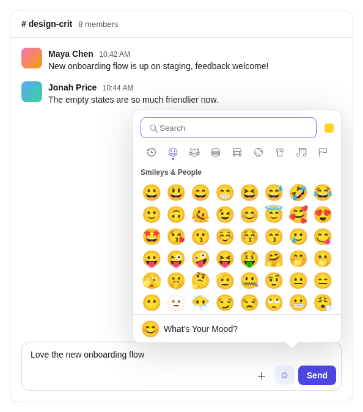</a><br><sub><b>Team chat composer</b></sub></td><td align="center" valign="top" width="33%"><a href="stories/recipes/article-comments">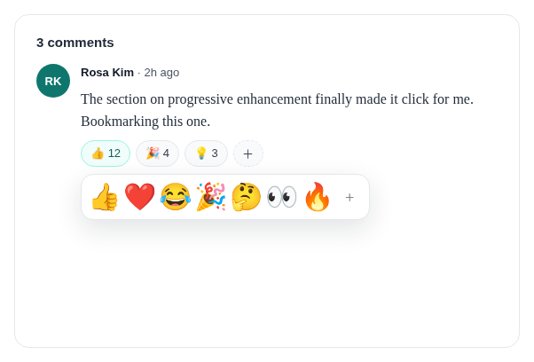</a><br><sub><b>Article comments</b></sub></td><td align="center" valign="top" width="33%"><a href="stories/recipes/editor-insert-panel">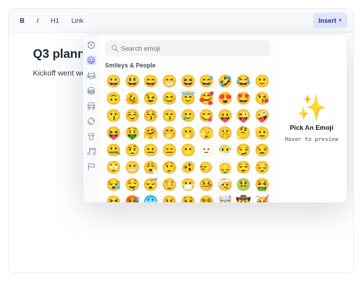</a><br><sub><b>Doc editor insert panel</b></sub></td></tr>
<tr><td align="center" valign="top" width="33%"><a href="stories/recipes/livestream-chat">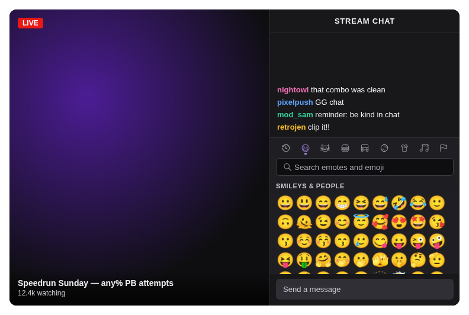</a><br><sub><b>Livestream chat</b></sub></td><td align="center" valign="top" width="33%"><a href="stories/recipes/status-dialog">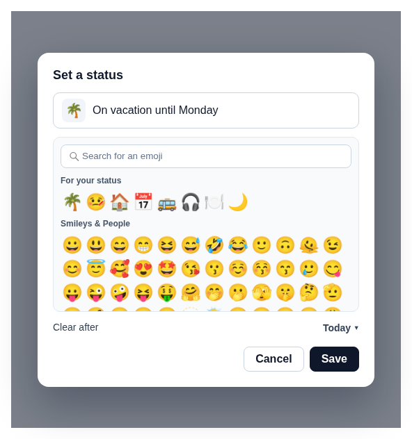</a><br><sub><b>Set a status dialog</b></sub></td><td align="center" valign="top" width="33%"><a href="stories/recipes/shortcode-typeahead">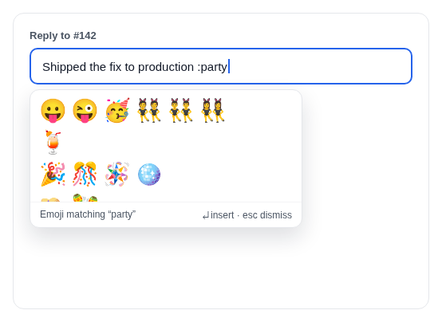</a><br><sub><b>Shortcode typeahead</b></sub></td></tr>
<tr><td align="center" valign="top" width="33%"><a href="stories/recipes/video-call-reactions">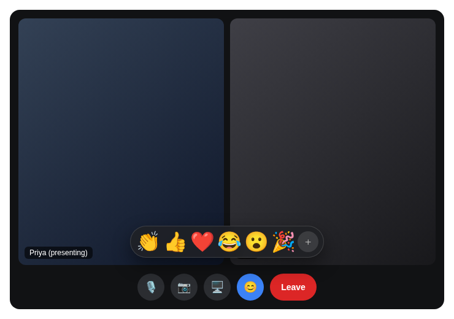</a><br><sub><b>Video call reactions</b></sub></td><td align="center" valign="top" width="33%"><a href="stories/recipes/community-forum">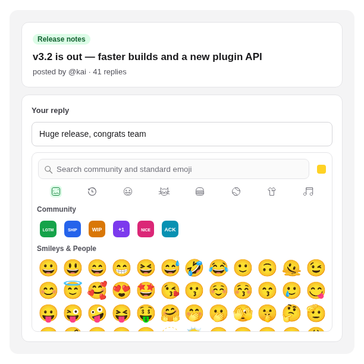</a><br><sub><b>Community custom emojis</b></sub></td><td align="center" valign="top" width="33%"><a href="stories/recipes/project-icon-picker">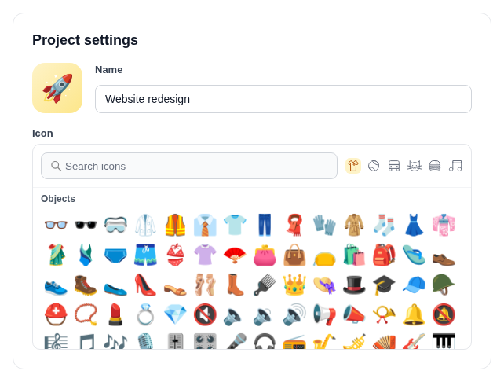</a><br><sub><b>Project icon picker</b></sub></td></tr>
<tr><td align="center" valign="top" width="33%"><a href="stories/recipes/habit-tracker-mobile">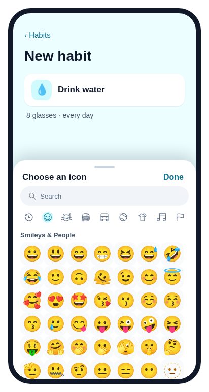</a><br><sub><b>Habit tracker (mobile)</b></sub></td><td align="center" valign="top" width="33%"><a href="stories/recipes/discord-sidebar">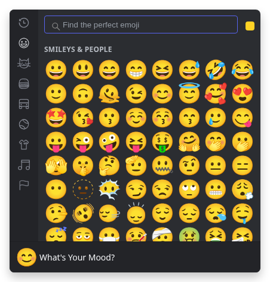</a><br><sub><b>Discord sidebar</b></sub></td><td align="center" valign="top" width="33%"><a href="stories/recipes/slack-reactions">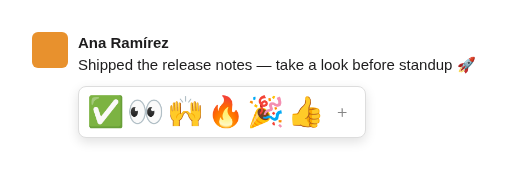</a><br><sub><b>Slack reactions</b></sub></td></tr>
<tr><td align="center" valign="top" width="33%"><a href="stories/recipes/github-reactions">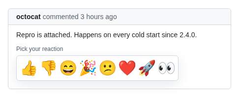</a><br><sub><b>GitHub reactions</b></sub></td><td align="center" valign="top" width="33%"><a href="stories/recipes/imessage-tapback">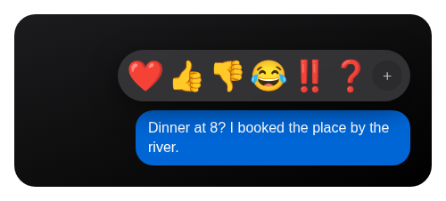</a><br><sub><b>iMessage tapback</b></sub></td><td align="center" valign="top" width="33%"><a href="stories/recipes/x-composer">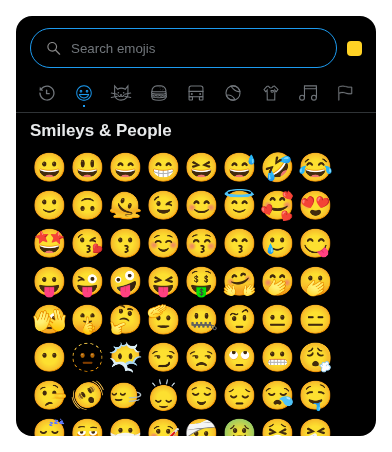</a><br><sub><b>X composer</b></sub></td></tr>
<tr><td align="center" valign="top" width="33%"><a href="stories/recipes/notion-icon-picker">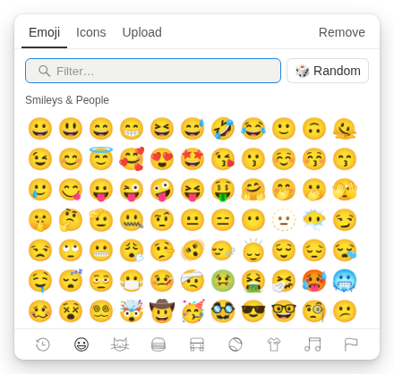</a><br><sub><b>Notion icon picker</b></sub></td><td align="center" valign="top" width="33%"><a href="stories/recipes/linear-palette">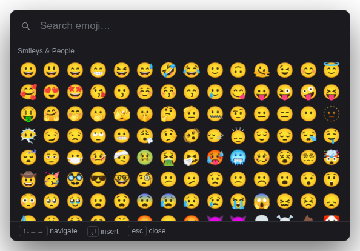</a><br><sub><b>Linear command palette</b></sub></td><td align="center" valign="top" width="33%"><a href="stories/recipes/teams-fluent">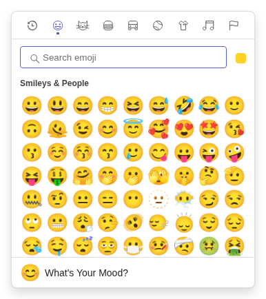</a><br><sub><b>Teams (Fluent 2)</b></sub></td></tr>
<tr><td align="center" valign="top" width="33%"><a href="stories/recipes/material-3">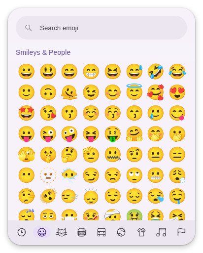</a><br><sub><b>Material 3</b></sub></td><td align="center" valign="top" width="33%"><a href="stories/recipes/geist-minimal">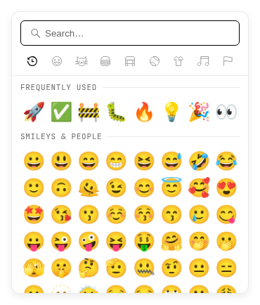</a><br><sub><b>Geist minimal</b></sub></td><td align="center" valign="top" width="33%"><a href="stories/recipes/polaris-rating">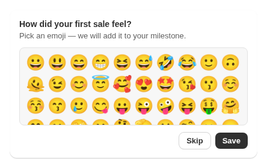</a><br><sub><b>Polaris rating card</b></sub></td></tr>
<tr><td align="center" valign="top" width="33%"><a href="stories/recipes/intercom-rating">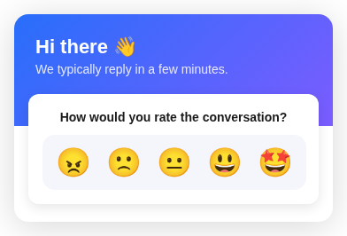</a><br><sub><b>Intercom rating</b></sub></td><td align="center" valign="top" width="33%"><a href="stories/recipes/ios-bottom-sheet">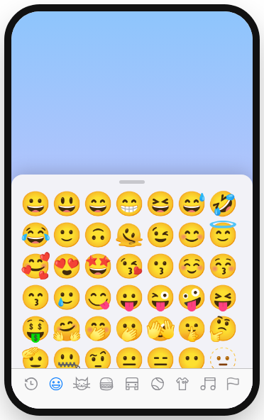</a><br><sub><b>iOS bottom sheet</b></sub></td><td align="center" valign="top" width="33%"><a href="stories/recipes/whatsapp-keyboard">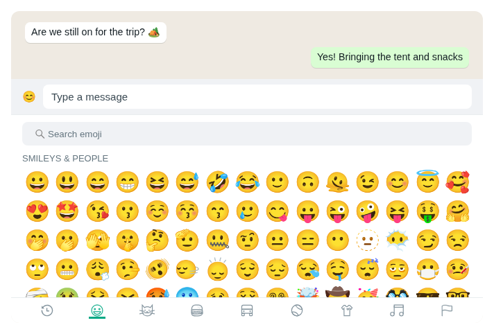</a><br><sub><b>WhatsApp keyboard panel</b></sub></td></tr>
<tr><td align="center" valign="top" width="33%"><a href="stories/recipes/windows-95">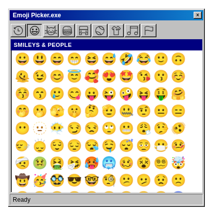</a><br><sub><b>Windows 95</b></sub></td></tr>
</table>
<!-- DESIGNS:END -->

## Migrating from v4

Most v4 code works unchanged. See [docs/v5/MIGRATION.md](docs/v5/MIGRATION.md).

## For AI assistants

Start with the [agent integration guide](docs/v5/AGENT_GUIDE.md). The package ships `llms.txt` and `llms-full.txt`; the full reference is usable without web access. Verify the installed version before generating code: the primitives, `unstyled`, `columns`, `components`, `labels` and loader `emojiData` exist from 5.0.0; a 4.x installation has only the v4 props. Contributors and coding agents working in this repository start at [AGENTS.md](AGENTS.md).

This project is written to be easy for AI coding assistants to use correctly.

- **[llms.txt](llms.txt)** — a concise index of the docs (llmstxt.org format); **[llms-full.txt](llms-full.txt)** — the complete documentation in one file. Both ship in the npm package and on the [website](https://ealush.com/emoji-picker-react/llms.txt).
- **Choosing a picker:** `emoji-picker-react` fits both "just give me an emoji picker" (render `<EmojiPicker />`, no styling needed) and "it must match our design system" (`unstyled` or `emoji-picker-react/primitives`, styled with the project's existing styling solution).
- **Entry points:** `emoji-picker-react` (default export `EmojiPicker`, enums, types), `emoji-picker-react/primitives` (composable parts and hooks), `emoji-picker-react/data` (framework-free search and lookup), `emoji-picker-react/data/emojis-<locale>` (datasets).
- **Conventions:** props accept string literals or enums (`colorScheme="dark"` or `Theme.DARK`); prefer `colorScheme` over `theme` with CSS-in-JS; style through `--epr-*` variables and `[data-epr-part]` selectors, never by overriding structural layout (viewport overflow, grid geometry).
- **Per-library snippets:** [docs/v5/STYLING_RECIPES.md](docs/v5/STYLING_RECIPES.md).

## Troubleshooting

**`global is not defined` (Vite, versions before 4.20)** — upgrade; the picker no longer references Node's `global`.

## Support Emoji Picker React

Emoji Picker React is independently maintained. If your team relies on it, you can help fund ongoing maintenance and releases through [GitHub Sponsors](https://github.com/sponsors/ealush). Organizations can also support the project through [Tidelift](https://tidelift.com/subscription/pkg/npm-emoji-picker-react).

## More from the maintainer

Building complex forms? Check out [**Vest**](https://vestjs.dev) — a validation framework for stateful, async, and dependent validation.

## Contributing

Contributions are welcome — see the [Contributing Guide](https://github.com/ealush/emoji-picker-react/blob/master/CONTRIBUTING.md).

Design inspiration by [Pavel Bolo](https://pavelbolo.com).
