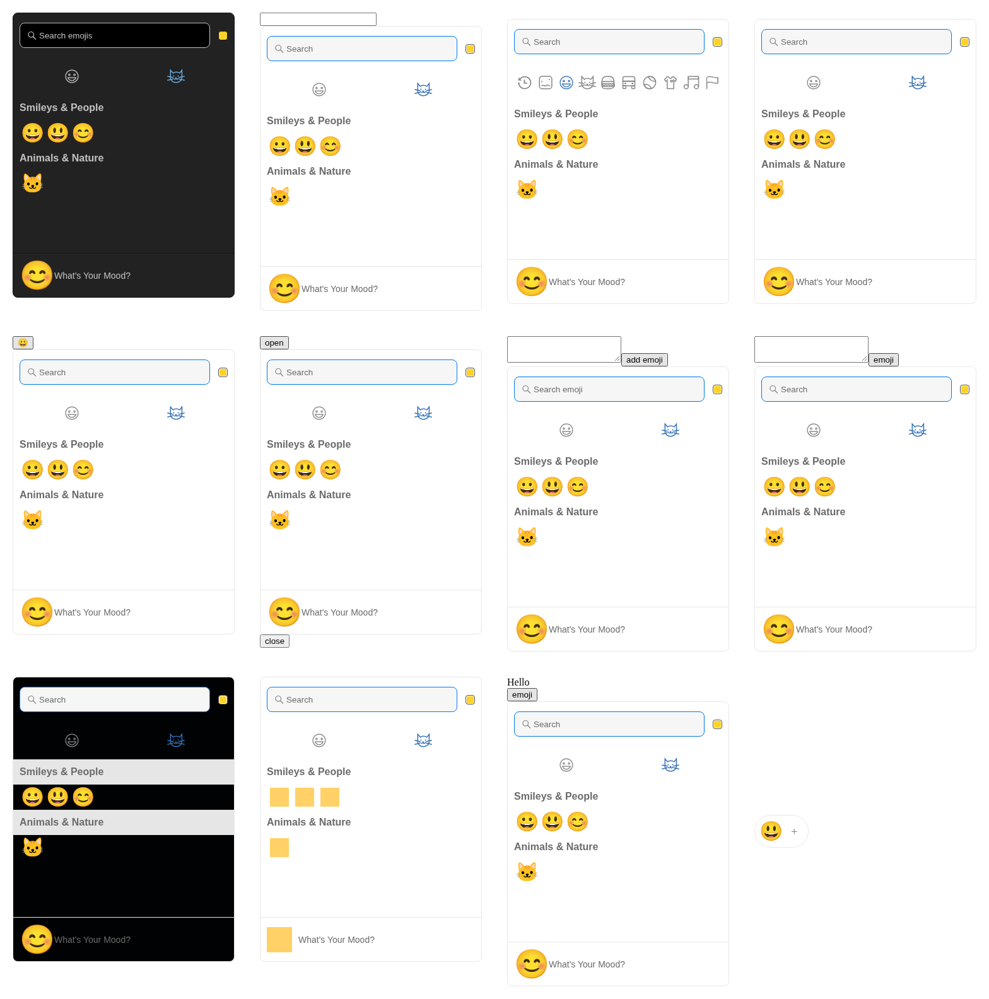
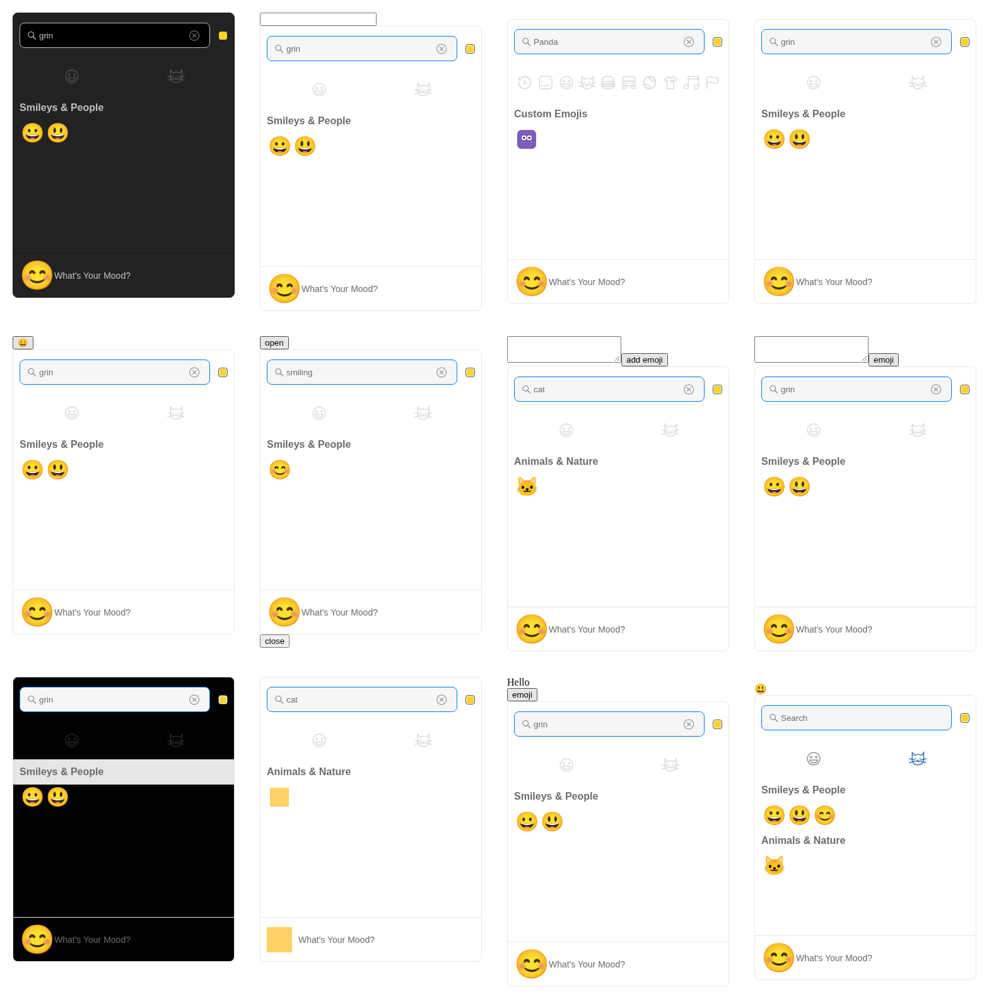
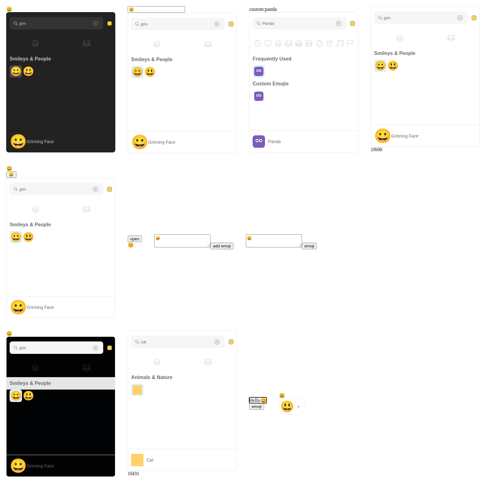

# Findings (2026-10-03, branch `v5-consumer-integration`)

## Headline

All 12 runnable consumer fixtures pass against the new picker source,
behaviorally and visually:
`npx vitest run integration` → 60/60, full `npm test` → 553/553 across
66 files (incl. 48 per-candidate coverage tests driven from the
manifest), `npx playwright test consumer-integrations` → 12/12 against
36 committed baselines (clean re-run, no updates). `tsc --noEmit` clean.
No picker source changes were needed; `src/` is untouched.

## Failures investigated (all resolved as fixture/test defects)

1. **Wrong `names` order in fixture data.** v5 `getAriaLabel` uses the LAST
   entry (`src/components/emoji/ClickableEmojiButton.tsx`), matching the
   real dataset convention (aliases first, display name last) and the repo's
   own tests. My first fixture draft had them backwards. Fixed in fixture.
2. **Grid-cell roles.** Emoji cells render with `role="gridcell"`, so
   `*ByRole('button')` misses them; label queries are the correct locator
   (mirrors `test/custom-groups.test.tsx`). Fixed in tests.
3. **Custom names are folded to lowercase** in the data snapshot
   (`customToRegularEmoji`, `src/data-core/pickerData.ts`). A declared
   `Panda` renders as label `panda`, matches any-case queries (query side is
   normalized), and reports `unified: 'panda'`, `names: ['panda']` in the
   click payload. I first suspected a case-sensitivity bug, wrote
   `test/custom-emoji-search.test.tsx` to prove it, watched it fail for the
   wrong reason (capitalized label query + button role), then reverted a
   no-op source edit once probing showed search itself works. The kept
   regression test now pins the real contract: any-case query finds the
   custom, payload carries `isCustom: true`.

## Intentional migration breakage (for release notes)

- **Push Chat `pickerStyle`:** the removed v4 prop does not crash, but it
  spreads onto the DOM (lowercased `pickerstyle` attribute) with a React
  "unrecognized prop" warning. The documented migration is `style`, which
  the fixture verifies applies. Consider stripping unknown props or
  documenting the warning; left unchanged as out of scope.

## Contract notes for consumers

- Custom emoji `unified`/`names` in `EmojiClickData` are the folded
  (lowercased) forms, not the declared capitalization. Relevant to
  ClassDojo-style custom search-result UIs that echo names back.
- Legacy v4 prop set used by Medusa (`theme`, `EmojiStyle.NATIVE`,
  `SkinTones.NEUTRAL`, `searchPlaceholder`) works unchanged on v5.
- Reactions path (`reactionsDefaultOpen`, `onReactionClick`) is isolated
  from `onEmojiClick` (Wire fixture asserts no cross-fire).

## Visual baselines (added second pass)

Review the contact sheets (montages of the committed baselines):

Individual baselines: `playwright/consumer-integrations.spec.ts-snapshots/`.

- Gallery `stories/consumers/ConsumerFixtures.stories.tsx`: 11 fixture
  stories + browsable `Index` (deep links to each story). Stories are
  deliberately not tagged `visual` so the load-only storybook-visual sweep
  ignores them; `playwright/consumer-integrations.spec.ts` owns them.
- 33 baselines (open / search-or-expand / selected per fixture) on the
  `consumer-shot-<key>` region, all 33 inspected via contact sheets before
  acceptance, clean re-run 11/11 without updates.
- CI job `consumer-visual` in `.github/workflows/tests.yml` runs the spec
  and uploads `test-results/` + actual/diff PNGs on failure (14-day
  retention). YAML validated.
- Failures fixed along the way (spec/fixture defects, not picker): Wire
  reaction buttons are native buttons (no `gridcell` role); LangWatch host
  result moved outside the dialog so closing doesn't unmount the evidence.

## Custom images must load, or the picker hides them (consumer risk)

Bisected live: my first custom-emoji fixture used an `example.com` imgUrl
that 404s, and the custom vanished from the real-browser list AND search
while jsdom stayed green -- because real browsers fire img error events
(feeding the picker's failed-image tracker) and jsdom never does. This is
correct picker behavior, but it is a real integration risk for
ClassDojo-style consumers: serve custom emoji from URLs that resolve, or
they silently disappear outside jsdom. Fixtures now use deterministic
data-URI artwork (`deterministicCustomImageUrl`,
`deterministicSpriteUrl`); production-shaped URLs remain only in the
behavioral URL-contract test, which doesn't render images.

## Second consumer-list drop (weekly downloads + dependents-ranked repos)

Folded in 40 new candidates (manifest now 89). Almost all are on v4
(latest 4.22.3); the single v3 consumer is `react-comments-section`
(+ its repo `RiyaNegi/react-comments-section`) -- recorded as a
documented-only v3->v5 migration gap, no fixture. Corrections from the
fresh check: `plane` is back to documented-only (still listed via pnpm
catalog, surface unverified -- the frimousse-migration claim is
withdrawn); `medusa` root no longer lists the picker but the published
`@medusajs/admin-ui` still does, so the Medusa fixture stays via the
package; `EmbeddedChat` updated to ^4.4.9; `memos` (63k stars) excluded
as removed; `million` is example-only.
- New runnable fixture: `SlateComposer` (`@prezly/slate-editor`,
  `prezly/slate`, plus `asma-ui-richeditor` on the shared editor
  boundary). Real Slate wrappers save the editor selection on open and
  restore it on select; the fixture does the same with the Selection API
  (capture on toggle mousedown). 3 baselines, inspected, clean re-run
  green. Limit: Slate normalization/history not exercised; Slate package
  itself not installed (unrelated dependency, boundary reproduced).
- Design systems (`@edifice.io/react`, `@selfcommunity/react-ui`,
  `fabri-pix`, `impact-ui`, `tedooo-web-design-system`, `@aircall/ds`,
  `@cgi-learning-hub/edifice-react`, framework) and chat/live-chat
  surfaces (`@open-slide/core`, `@realtimexsco/live-chat`, `postiz-app`,
  `coai`, `ChatAny`, `blinko`, `OpenGpt`, `ChatGPT-On-CS`, `openagent`,
  `jan`, `penx`, `useSend`, `unstract`, `open-slide`) map to the existing
  Fileverse / NextChat / Cherry / Botonic fixtures by identical boundary.
- Left explicit gaps: `wini-web-components` (React-in-custom-element
  boundary not reproduced), `orca` (dev-only dep), `plasmic`/`argent-x`/
  `meshery`/`lightdash`/`vanguard`/`@autono/*` (surface unknown).

## Coverage and gaps

- Runnable: 12 fixtures (NextChat, Cherry, Wire, LangWatch, Botonic,
  Fileverse, json-joy, Medusa, Push, ClassDojo, Slate, Signal). Indirect consumers
  (`@jsonjoy.com/collaborative-*`, `@fileverse-dev/ddoc/dsheet`,
  `@medusajs/admin`, `@botonic/plugin-flow-builder`,
  `@fileverse-dev/fortune-react`, `@open-slide/core` chain,
  `@jsonjoy.com/ui` chain) share these fixtures; see `manifest.json`.
- Documented-only with reasons: 42 entries in `manifest.json`
  (no public source, unverified graph-only, stale, historical, dev-only,
  example-only, v3 gap, or unknown surface),
  plus 31 indirect covered by shared fixtures.
  Excluded: `usememos/memos` (removed).
- Not done: full upstream app clones, reference-vs-target (4.22.2)
  differential run, SSR/hydration per consumer (covered by repo suite
  instead).
